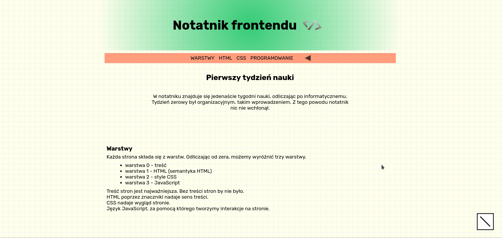

# Notatnik frontendu

## Opis projektu
Podczas jakiejkolwiek nauki każdy z nas robi notatki. Jako że obecnie uczę się programowania webowego, również postanowiłem notować, jednak w formie cyfrowej. Takim sposobem szybciej zapamiętuję oraz utrwalam nową wiedzę. Dodatkowym atutem takiego rozwiązania może być dostępność z każdego miejsca. Więc w razie potrzeby skorzystania z notatek będzie to możliwe w sposób szybki i wygodny. Może też okazać się bardzo pomocny na początku w pracy. To miejsce jest moim cyfrowym notatnikiem.
## Technologie
- HTML5
- CSS
- JavaScript
## Metodologie użyte w projekcie
- BEM
- SASS (składnia SCSS)
## Automatyzacja
### WTF gulp starter kit
- live server
- kompilacja SASS do CSS
- minifikacja
- dodanie prefiksów
- publikacja strony na github pages
#### Instalacja projektu

`npm install -g gulp-cli`

`npm install`

#### Użycie

`gulp`

Publikacja strony na github pages `npm run deploy`

[NOTATNIK Frontendu](https://andrzej-jablonski-project.github.io/Notatnik-frontendu/index.html)
